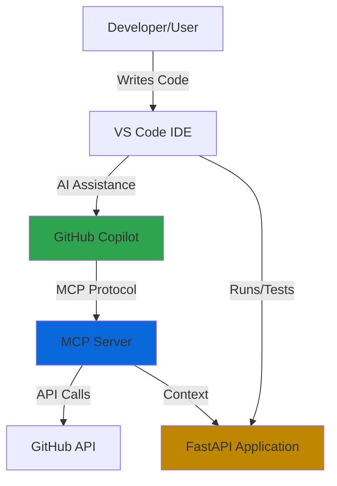
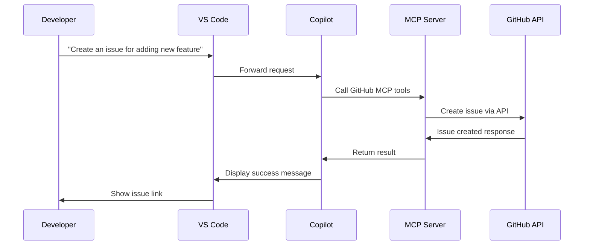

# Architecture Guide: Building Your Own CoPilot

This guide explains the architecture of the CoPilot-Developers project and provides a blueprint for building your own AI-enhanced development system.

## 🎯 Overview

This project demonstrates how to integrate GitHub Copilot with external services using the Model Context Protocol (MCP), creating an AI-enhanced development workflow for a web application.

## 🏛️ System Architecture



### Key Components

1. **Development Environment (VS Code)**
   - IDE where developers write code
   - Hosts GitHub Copilot extension
   - Provides debugging and testing capabilities

2. **GitHub Copilot**
   - AI-powered code completion and generation
   - Interprets natural language prompts
   - Integrates with MCP servers for extended capabilities

3. **MCP Server (Model Context Protocol)**
   - Acts as a bridge between Copilot and external services
   - Provides standardized interface for AI tool integration
   - Handles authentication and request routing

4. **External Services (GitHub API)**
   - Issue management
   - Repository operations
   - Project tracking
   - CI/CD workflows

5. **Application Layer (FastAPI)**
   - Core business logic
   - REST API endpoints
   - Data management
   - Domain-specific functionality

## 🔄 Data Flow

### 1. Development Workflow

```
Developer → Natural Language Prompt → GitHub Copilot
    ↓
Copilot analyzes context and determines needed actions
    ↓
Copilot → MCP Server → External Services (e.g., GitHub)
    ↓
MCP Server returns data → Copilot
    ↓
Copilot generates code/response → Developer
```

### 2. MCP Integration Flow



## 📦 Component Details

### Model Context Protocol (MCP)

**What is MCP?**

MCP is a universal protocol that enables AI applications to seamlessly interact with different data sources and services. Think of it as "USB-C for AI" - a standard interface that works across different systems.

**Why MCP?**

- **Standardization**: One protocol for multiple services
- **Flexibility**: Easy to add new integrations
- **Context**: Provides AI with domain-specific knowledge
- **Efficiency**: Reduces context switching for developers

**MCP Configuration**

```json
{
  "servers": {
    "github": {
      "type": "http",
      "url": "https://api.githubcopilot.com/mcp/"
    }
  }
}
```

This configuration:
- Defines available MCP servers
- Specifies connection details
- Enables Copilot to use GitHub tools

### FastAPI Application

**Architecture Pattern**: RESTful API

**Key Features**:
- Fast and modern Python framework
- Automatic API documentation (OpenAPI/Swagger)
- Type hints and validation
- Easy testing and debugging

**Endpoints**:
```
GET  /                              → Redirect to frontend
GET  /activities                    → List all activities
POST /activities/{name}/signup      → Sign up for activity
DEL  /activities/{name}/unregister  → Remove from activity
```

**Data Model**:
```python
Activity {
    description: str
    schedule: str
    max_participants: int
    participants: List[str]  # email addresses
}
```

## 🏗️ Building Your Own System

### Step 1: Define Your Domain

Choose what your application will do:
- Issue tracking
- Project management
- E-commerce
- Social networking
- Educational platform
- etc.

### Step 2: Design Your API

1. **Identify Resources**: What entities exist? (users, activities, posts)
2. **Define Operations**: What actions can be performed? (create, read, update, delete)
3. **Map to HTTP**: Choose appropriate HTTP methods and paths

Example:
```
Resources: Activities, Students, Teachers
Operations: View, Sign Up, Cancel, Create

Endpoints:
GET    /activities           - List activities
POST   /activities           - Create activity
GET    /activities/{id}      - Get activity details
POST   /activities/{id}/join - Join activity
```

### Step 3: Implement the Core Application

Choose your technology stack:

**Backend Options**:
- Python: FastAPI, Flask, Django
- JavaScript/TypeScript: Express, NestJS, Fastify
- Go: Gin, Echo, Chi
- Ruby: Rails, Sinatra
- Java: Spring Boot

**Database Options**:
- PostgreSQL (relational)
- MongoDB (document)
- Redis (cache)
- SQLite (embedded)

### Step 4: Set Up MCP Integration

1. **Create MCP Configuration File**

```json
{
  "servers": {
    "your-service": {
      "type": "http",
      "url": "https://your-service-api.com/mcp/"
    }
  }
}
```

2. **Define MCP Capabilities**

Your MCP server should expose:
- Available tools/functions
- Required parameters
- Return types
- Authentication requirements

3. **Implement MCP Endpoints**

Create endpoints that Copilot can call:
```python
@app.post("/mcp/tools/list")
def list_tools():
    return {
        "tools": [
            {
                "name": "create_activity",
                "description": "Create a new activity",
                "parameters": {...}
            }
        ]
    }
```

### Step 5: Enhance with AI Context

Provide context to make AI assistance more effective:

1. **Code Comments**: Explain complex logic
2. **Documentation**: README, API docs, architecture docs
3. **Type Hints**: Use strong typing
4. **Examples**: Show usage patterns
5. **Tests**: Demonstrate expected behavior

### Step 6: Test and Iterate

1. **Manual Testing**: Try different prompts with Copilot
2. **API Testing**: Verify endpoints work correctly
3. **Integration Testing**: Ensure MCP integration works
4. **User Testing**: Get feedback from real users

## 🎨 Design Patterns

### 1. RESTful API Design

**Principles**:
- Use nouns for resources, not verbs
- Use HTTP methods appropriately
- Return appropriate status codes
- Use consistent naming conventions

**Good**:
```
POST /activities          → Create activity
GET  /activities/{id}     → Get activity
PUT  /activities/{id}     → Update activity
DELETE /activities/{id}   → Delete activity
```

**Avoid**:
```
POST /createActivity
GET  /getActivityById
POST /updateActivity
POST /deleteActivity
```

### 2. Separation of Concerns

Keep different aspects of your application separate:

```
/src
  /api          - API endpoints
  /models       - Data models
  /services     - Business logic
  /utils        - Helper functions
  /static       - Frontend assets
```

### 3. Error Handling

Provide clear, actionable error messages:

```python
@app.post("/activities/{name}/signup")
def signup(name: str, email: str):
    if name not in activities:
        raise HTTPException(
            status_code=404,
            detail=f"Activity '{name}' not found"
        )
    
    if email in activities[name]["participants"]:
        raise HTTPException(
            status_code=400,
            detail="Already signed up for this activity"
        )
```

## 🔒 Security Considerations

### Authentication & Authorization

1. **API Keys**: For service-to-service communication
2. **OAuth**: For user authentication
3. **JWT Tokens**: For stateless sessions
4. **RBAC**: Role-based access control

### Input Validation

Always validate and sanitize input:

```python
from pydantic import BaseModel, EmailStr, validator

class SignupRequest(BaseModel):
    email: EmailStr
    
    @validator('email')
    def email_must_be_school_domain(cls, v):
        if not v.endswith('@mergington.edu'):
            raise ValueError('Must be a school email')
        return v
```

### Rate Limiting

Protect your API from abuse:

```python
from slowapi import Limiter
from slowapi.util import get_remote_address

limiter = Limiter(key_func=get_remote_address)
app.state.limiter = limiter

@app.post("/activities/{name}/signup")
@limiter.limit("5/minute")
async def signup(...):
    ...
```

## 📈 Scaling Considerations

### Start Simple

1. **In-Memory Storage**: Good for prototypes
2. **SQLite**: Good for small applications
3. **PostgreSQL**: Good for production

### Add Complexity as Needed

1. **Caching**: Redis for frequently accessed data
2. **Load Balancing**: Multiple app instances
3. **Message Queues**: Async task processing
4. **CDN**: Static asset delivery
5. **Monitoring**: Application observability

## 🧪 Testing Strategy

### Unit Tests

Test individual functions:

```python
def test_signup_success():
    response = client.post(
        "/activities/Chess Club/signup",
        params={"email": "test@mergington.edu"}
    )
    assert response.status_code == 200
```

### Integration Tests

Test component interactions:

```python
def test_signup_and_list():
    # Sign up
    client.post("/activities/Chess Club/signup", ...)
    
    # Verify in list
    response = client.get("/activities")
    assert "test@mergington.edu" in response.json()["Chess Club"]["participants"]
```

### End-to-End Tests

Test complete workflows with Copilot integration.

## 📚 Additional Resources

### Learning Paths

1. **Beginner**: 
   - Learn Python/JavaScript basics
   - Build a simple REST API
   - Add basic MCP configuration

2. **Intermediate**:
   - Add database persistence
   - Implement authentication
   - Create comprehensive tests

3. **Advanced**:
   - Custom MCP server implementation
   - Multi-service orchestration
   - Production deployment

### Tools & Frameworks

- **API Development**: FastAPI, Express, Spring Boot
- **MCP**: Model Context Protocol libraries
- **Testing**: pytest, Jest, JUnit
- **Documentation**: Swagger/OpenAPI, Sphinx
- **Deployment**: Docker, Kubernetes, Vercel

## 🎓 Best Practices Summary

1. ✅ **Start Small**: Build incrementally
2. ✅ **Document Well**: Clear docs help AI and humans
3. ✅ **Test Thoroughly**: Automated tests catch issues early
4. ✅ **Use Standards**: Follow REST, HTTP conventions
5. ✅ **Think About Scale**: Design for growth
6. ✅ **Secure by Default**: Authentication, validation, rate limiting
7. ✅ **Monitor Everything**: Logs, metrics, alerts
8. ✅ **Iterate Based on Feedback**: Listen to users

## 🤝 Contributing

Want to improve this architecture guide? See [CONTRIBUTING.md](CONTRIBUTING.md) for details on how to submit improvements and ideas.

---

**Questions?** Open an issue or start a discussion. We're here to help you build your own CoPilot-enhanced application! 🚀
